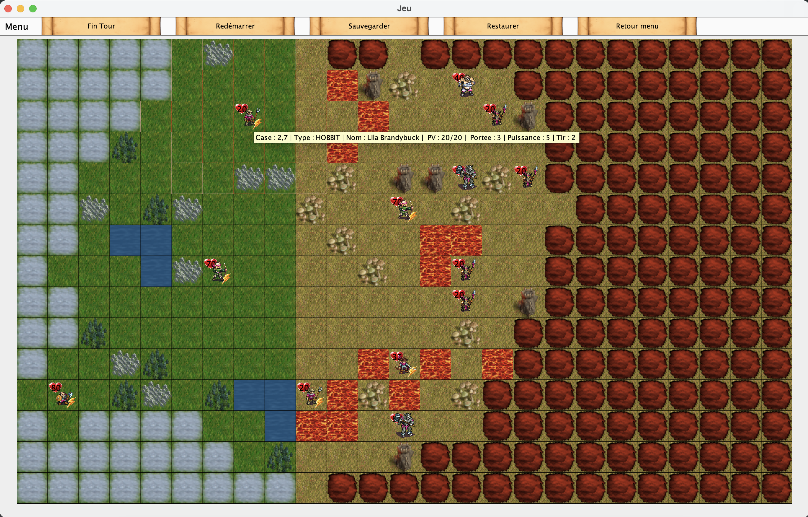

# Projet de POO

## Introduction
Ce projet de POO est un travail de groupe réalisés par :
- Simon Arnaud
- Vasily Somsaath
- Mehenni Jughurta

Il a été effectué sur une période du : 19/10/25 au 14/01/26, et a été réalisé entièrement via Java.

### But du projet
Le but de ce projet a été de réalisé un jeu de guerre se basant sur un univers fictif (style seigneur des anneaux ), dans ce jeu nous incarnons un général qui doit dirigé son armée de héros (nain,humain,hobbit,elf) contre l'armée des monstres (troll,orc,gobelin) qui étend son territoire de manière aggressive. L'objectif est donc d'éliminé tout les monstres présents sur la carte avec au moins un héros restant à la fin.

### Plan du rapport
Pour le plan de ce rapport, après cette courte introduction, il y aura une analyse du projet afin de présenter la structure même utilisé puis nous présenterons de manière synthétique le résultat de notre travail, pour ensuite présenter l'ogranisation et les ressources utilisés à la conception du projet et pour finir une conclusion afin de réfléchire à ce que le projet nous a apporté.

## Analyse du projet

### Diagramme UML

{ width=75% }

## Les techniques de POO/Java utilisés

### Interface
L'interface IConfig est utilisé pour gérer toutes les données importantes globales du jeu tandis que les interfaces ICarte et ISoldat sont spécialisés pour les classes Carte et Soldat respectivement.

### Composition
Les compositions majoritaires sont celles vers la carte, car c'est cette classe qui va contenir les données principales du jeu et qui va faire fonctionner le tout.

### Héritage
L'héritage est utilisé à partir de la classe élément afin de définir tout les éléments possibles du jeu

## Resultat

### Elements visuels
Sur cette capture d'écran nous pouvons voir d'abord en haut comme demandé dans le sujet un menu ainsi que des boutons qui contiennent les mêmes fonctionnalités, il est également possible de finir le tour via la touche f et l'on peut sélectionné directement un élément via les touches de 0 à 9 en fonctions du nombre de héros.
Pour ce qui est du plateau, l'element principal du jeu, (il est représenté par des carrés car nous n'avons pas eu le temps de le réaliser en hexagones) permet de voir les différents éléments du jeu ainsi que de clicker (ce qui géneres un son de click) sur un héros afin de voir son champ de déplacement et son champ visuelle. Pour ce qui est de l'info-bulle, elle permet de voir les informations de l'element sur lequel est la souris.

## Organisation

### Estimation du temps consacré
Nous n'avons pas vraiment mesuré exactement le temps mais nous pensons être aux alentours des 30-40h de travail pour chaque étudiants, tout compris

### Répartition des tâches
Nous avons travaillé ensemble de manière équilibré, nous pouvons donc nous donner un pourentage équivalents:
33% - Simon Arnaud 
33% - Vasily Somsaath
33% - Mehenni Jughurta

Nous n'avons pas vraiment eu une répartition des tâches strictes même si certaines methodes/fonctionnalités on été plus faites par certains membres que d'autres.

## Ressources utilisés

### Musique :
Boucle de musique : https://kled.gumroad.com/l/zvpao?
Son de click / attaque : Freesound.org + logiciel en ligne de retouche

### Images :
Github de Wesnoth pour unités et terrains + chatgpt pour boutons et titre de menu et de victoire/défaite

### Textes :
Pour les listes de noms des personnages, nous les avons généré via chatgpt.

## Conclusion

### Résultat
Nous avons réalisé avec un travail modéré un projet dont nous sommes plutôt fiers, il y a encore des points qui pourraient être améliorés mais par rapport au temps consacrés nous trouvons le résultat correct.

### Points forts
Nos points forts sont que nous avons touchés à réfléchis à tous ce qui nous semblaient importants, nous avons un affichage et un gameplay que nous trouvons satisfaisants et ce projet nous a permis de nous faire un bon lancement sur la POO.

### Points faibles
Nous n'avons pas utilisé notre temps de la manière la plus efficace et nous aurions pu faire bien plus, nous avons par exemple abandonné l'idée d'utiliser des hexagones à la place des carrés car nous nous y sommes pris trop tard.

### Impressions sur la POO
Nous sommes d'accord pour dire que la POO/Java est bien plus logique et structuré que ce que nous faisions avant, malgré notre manque d'organisation, il a comme même été bien plus facile de s'organiser et de récupéré le travail des uns et des autres que sur les autres projets grâce à l'organisation du code et de sa structure par class/méthodes.
